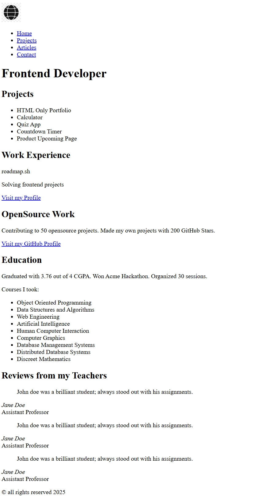

# my-roadmap-projects
Projects from roadmap.sh. It consists of my progress as a future fullstack web developer.
I have been watching and learning HTML and CSS for a month now and learned the basics. I am here at roadmap to test my skills with the projects they provide.

## PROJECT URL

  You can check the image for each project @assets>roadmap-preview-images.

  

    1. Single Page CV
    https://roadmap.sh/projects/single-page-cv
  

  

  

    2. Basic HTML Website
    https://roadmap.sh/projects/basic-html-website
  

  

